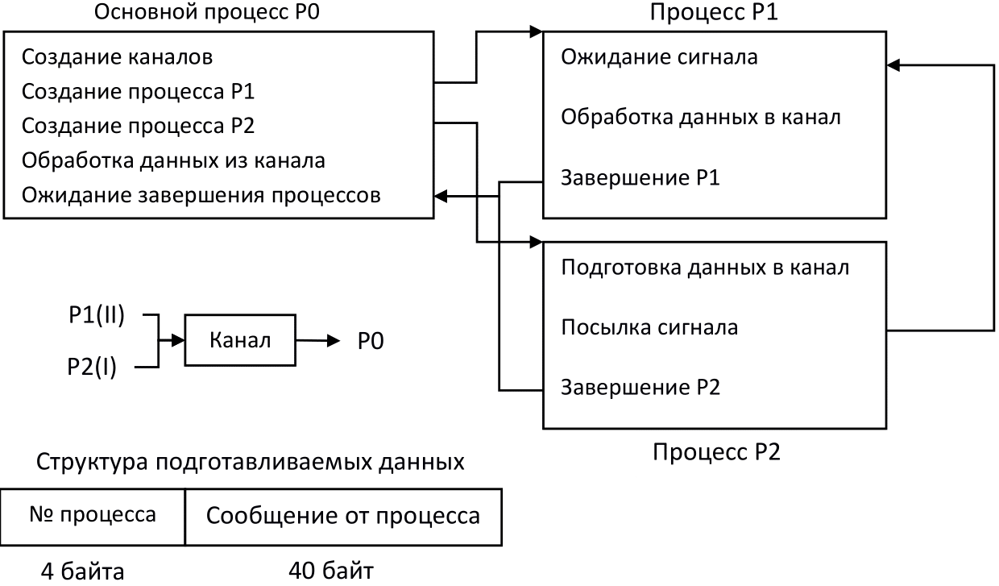

# Лабораторные работы по дисциплине "Управление ресурсами в вычислительных системах" на факультете ПМИ, НГТУ
&nbsp;  

## 1. Управление системными ресурсами средствами Shell-интерпретатора
### Условия задачи

Ознакомиться с основами программирования на уровне командного языка Shell путем написания Shell-программ для работы с файловой 
системой. 

Shell-программа объединяет все временные файлы с указанным суффиксом (например, .tmp) в поддереве, начиная с каталога, имя которого 
задано параметром Shell-программы. Результат объединения помещается либо в указанный Shell-программой файл, либо выводится на экран в 
форме:  
```sh
    <имя каталога>:  <имя файла>   ←   начальный каталог  
                     [содержимое файла]  
                     End of file  
                     <имя файла>  
                     [содержимое файла]  
                     End of file  
                     ............  
    <имя каталога>:  <имя файла>   ←   подкаталог  
                     [содержимое файла]  
                     End of file  
                     <имя файла>  
                     [содержимое файла]  
                     End of file  
                     ............  
```

&nbsp;  

## 2. Файловая система ОС UNIX
### Условия задачи

Разработать программу, которая выводит на экран имена тех каталогов, которые находятся в текущем каталоге и содержат в себе 
подкаталоги.  
&nbsp;  

## 3. Структура системы управления вводом-выводом в ОС UNIX
### Условия задачи

Разработать программу, демонстрирующую работу ОС UNIX при открытии файла процессом. При этом достаточно показать только динамику 
создания таблиц, связанных с этим событием (таблица описателей файла, таблица файлов, таблица открытых файлов процесса). Например, 
сценарий программы может быть следующим:
* неявное открытие стандартного файла ввода;
* неявное открытие стандартного файла вывода;
* неявное открытие стандартного файла вывода ошибок;
* открытие первого пользовательского файла;
* открытие второго пользовательского файла;
* открытие третьего пользовательского файла.  

После каждого из этапов печатаются таблица описателей файлов, таблица файлов, таблица открытых файлов процессов.  
&nbsp;  

## 4. Порождение нового процесса и работа с ним. Запуск прогрммы в рамках порождённого процесса. Сигналы и каналы в UNIX
### 4.1
### Условия задачи

Разработать программу, вычисляющую число сочетаний 
. 
Для вычисления факториалов *n!*, *k!*, 
*(n - k)!* должны быть порождены три параллельных процесса-потомка. Выполнить работу с учётом следующих требований:  
1. все действия, относящиеся как к родительскому процессу, так и к порожденным процессам, выполняются в рамках одного исполняемого 
файла;  
2. обмен данными между процессом-отцом и процессом-потомком предлагается выполнить посредством временного файла: процесс-отец после 
порождения процесса-потомка постоянно опрашивает временный файл, ожидая появления в нем информации от процесса-потомка;   
3. если процессов-потомков несколько, и все они подготавливают некоторую информацию для процесса-родителя, каждый из процессов 
помещает в файл некоторую структурированную запись, при этом в этой структурированной записи содержатся сведения о том, какой процесс 
посылает запись, и сама подготовленная информация.  

### 4.2
### Условия задачи

Модифицировать ранее разработанную программу с учетом следующих требований:  
1. действия процесса-потомка реализуются отдельной программой, запускаемой по одному из системных вызовов **execl()**, 
**execv()** и т.д. из процесса-потомка;  
2. процесс-потомок, после порождения, должен начинать и завершать свое функционирование по сигналу, посылаемому процессом-предком 
(это же относится и к нескольким процессам-потомкам);  
3. обмен данными между процессами необходимо осуществить через программный канал.  
&nbsp;  

## 5. Синхронизация процессов
### Условия задачи

Разработать программу для решения задачи синхронизации процессов и их взаимодействия посредством программных каналов.  
Исходный процесс создает программный канал **К1** и порождает два процесса **Р1** и **Р2**, каждый из которых готовит данные для 
обработки их основным процессом. Подготовленные данные последовательно помещаются процессами-сыновьями в программный канал и передаются
основному процессу. Схема взаимодействия процессов, порядок передачи данных в канал и структура подготавливаемых данных показаны ниже:  
 
<p align="center">  </p>

Обработка данных основным процессом заключается в чтении информации из программного канала и печати её. Кроме того, посредством 
выдачи сообщений необходимо информировать обо всех этапах работы программы (создание процесса, завершение посылки данных в канал и т.д.).  
&nbsp;  

## 6. Моделирование работы интерпретатора
### Условия задачи

Разработать программу, моделирующую работу Shell-интерпретатора при обработке командной строки:  
```sh
    tr -d "[0-9]" < input_filename | sort | uniq > output_filename
```
При реализации программы путем выдачи сообщений информировать обо всех этапах ее работы (создан процесс, выполнение команды закончено и т.д.).  
&nbsp;  

## 7. Межпроцессорное взаимодействие программ
### Условия задачи

Разработать программу, моделирующую работу монитора обработки сообщений. Порожденные процессы, обладающие различными приоритетами и 
выполняющие некоторые циклы работ, посредством очереди сообщений передают родительскому процессу имена программ из предыдущих 
лабораторных работ, которые им должны быть запущены. Родительский процесс, обрабатывая сообщения в соответствии с их приоритетами, 
следит, чтобы одновременно было запущено не более **N** экземпляров программ (терминалов).  
&nbsp;  

## 8. Клиент-серверное взаимодействие посредством сокетов в режиме TCP-соединения
### Условия задачи

Эмуляция DNS сервера. Клиент подсоединяется к серверу, IP которого хранится в файле **dns.url**, и делает ему запрос на подключение к 
серверу "Имя сервера". DNS-сервер имеет список, хранящийся в файле о соответствии имен серверов и IP-адресов. Если в списке нет 
"имени сервера", запрошенного клиентом, то сервер DNS подключается последовательно к другим серверам, хранящимся в файле **dns.url**, 
и т.д. Если сервер не найден, клиенту возвращается соответствующее сообщение.  
&nbsp;  

## RGZ. Управление ресурсами в OC Windows
### Условия задачи

Изучить основные особенности ОС Windows: работа с потоками, организация графического интерфейса, механизма обработки сообщений, 
использование динамически подключаемых библиотек (DLL), низкоуровневое взаимодействие с процессором.  
 
**Уровень сложности I, II, III**  
Реализовать графическое Windows-приложение, в котором при создании окна, но до момента его отображения на экране, создаётся дочерний 
поток, который реализует задачу определения текущего времени, после чего полученный результат отображается в графическом окне. Функция, 
выполняющая поставленное задание должна быть реализована в виде динамической библиотеки (DLL).  
 
**Уровень сложности IV**  
Определить размер КЭШа данных третьего уровня, реализовав требования I, II и III уровня, дополнив получившуюся функцию из динамической
библиотеки ассемблерными вставками. 
